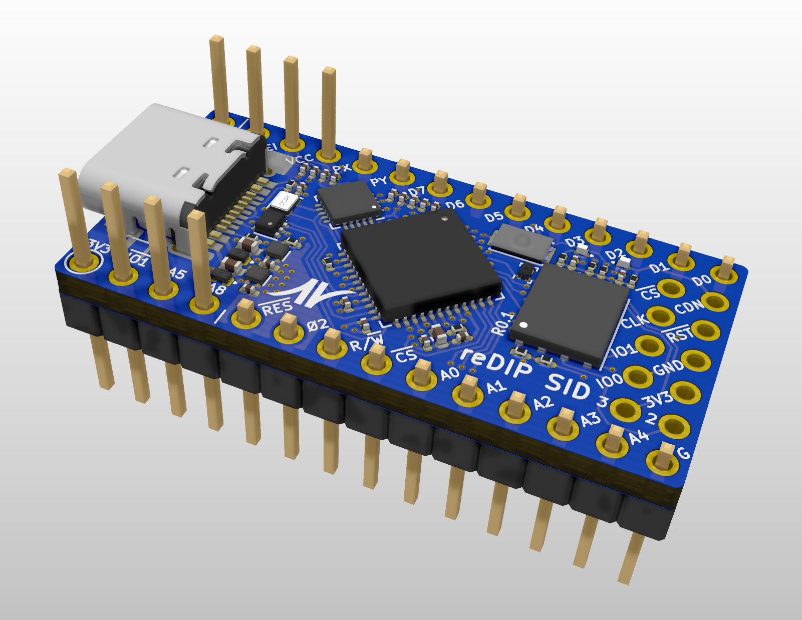
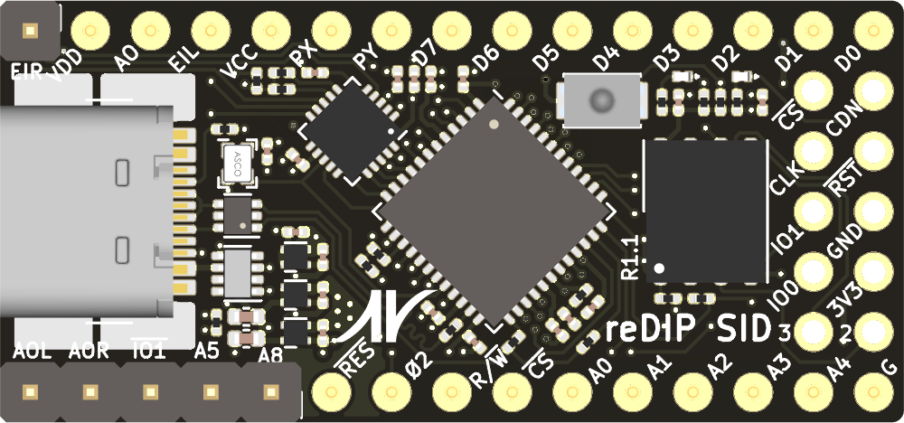
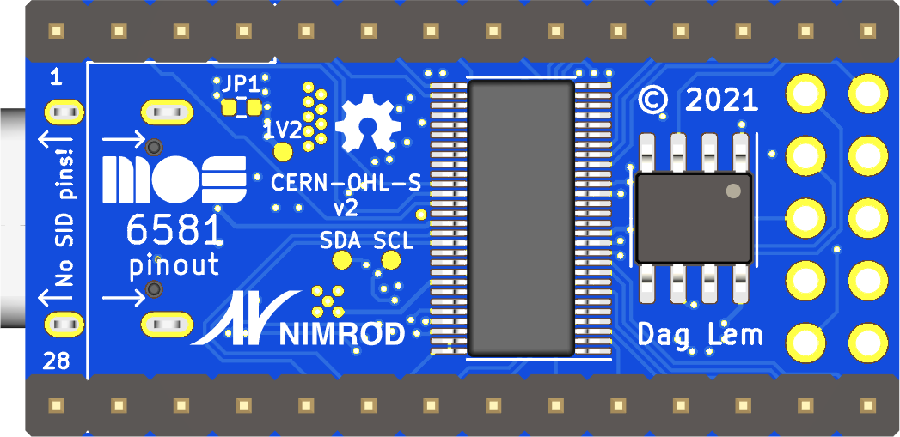

# reDIP SID

## iCE40UP5K / SGTL5000 development board with MOS 6581/8580 SID pinout

## Overview
The reDIP SID is an open source hardware development board which combines the following in a DIP-28 size package:

* iCE40UP5K FPGA
* SGTL5000 Audio Codec
* 128Mbit FLASH
* 64Mbit PSRAM
* LED
* Push button
* USB-C receptacle for power and FPGA Full Speed USB
* 5V tolerant I/O

The reSID SID is a leaner relative of the [reSID sx](https://github.com/daglem/reDIP-sx),
more squarely focused on providing a platform for MOS 6581/8580 SID emulation.
It also aims to be a good no-frills choice for generic FPGA projects which may find use for audio and/or 5V tolerant I/O.

## General use

### I/O interfaces

#### Header pins:

* 5V input
* 3.3V output
* 20 FPGA GPIO
* 2 FPGA current drive / open-drain I/O
* 3 audio pins (line input, stereo headphone output)
* GND

All FPGA I/O is 5V tolerant, and can drive 5V TTL. JP1 can be shorted to make the 5V input pin bidirectional, e.g. for powering 5V TTL devices.

The number of FPGA I/O is sufficient for e.g. 5 six-pin PMOD interfaces, or two twelve-pin and one six-pin PMOD interfaces.

#### FPGA SPI / Programming:

A separate header footprint is provided for FPGA SPI / programming, with pinout borrowed from the [iCEBreaker Bitsy](https://github.com/icebreaker-fpga/icebreaker).

#### USB-C functions:

* 5V power
* FPGA Full Speed USB

## MOS 6581/8580 SID compatibility

The board is mostly pin compatible with the venerable MOS 6581/8580 SID sound chip.

For anyone wanting to experiment with a SID setup, while avoiding damaged sockets and release of magic smoke:

* Make sure that JP1 is open
* Remove pins 1 - 4 and 28 from a 28 pin stamped DIP socket, and use this as an adapter. Do not attempt to mount the board directly in a SID socket!

## Disclaimer

Please note that this is only my second board - rookie mistakes are probably made, and feedback is welcome. The board has not been manufactured yet, and is thus completely untested.

## Board Front

## Board Back

