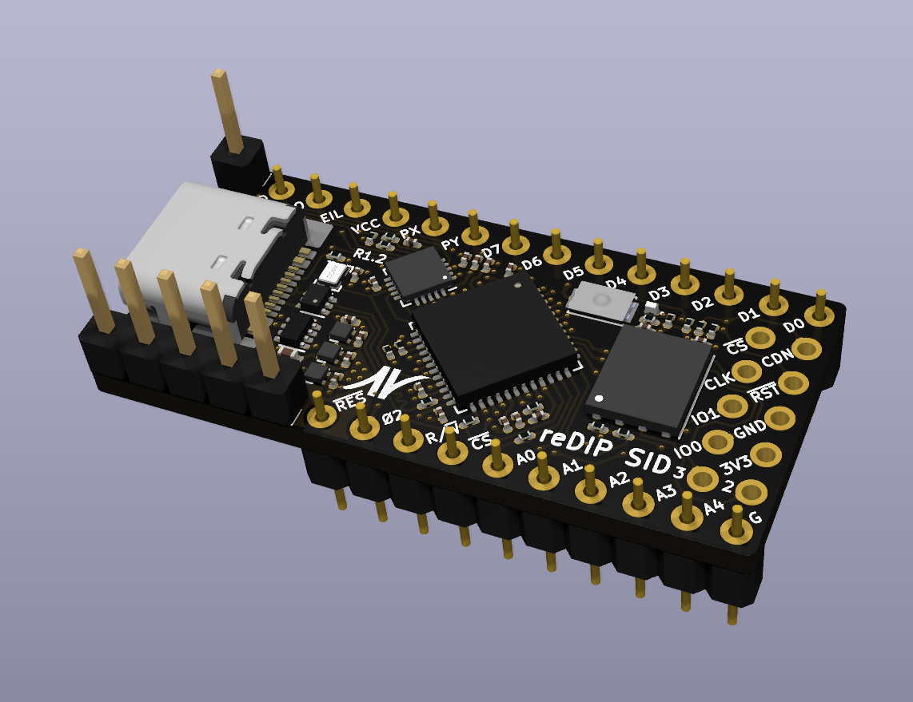
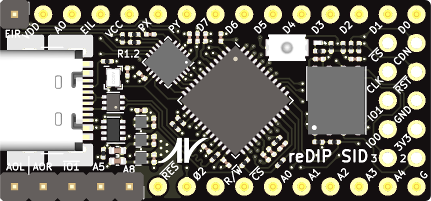
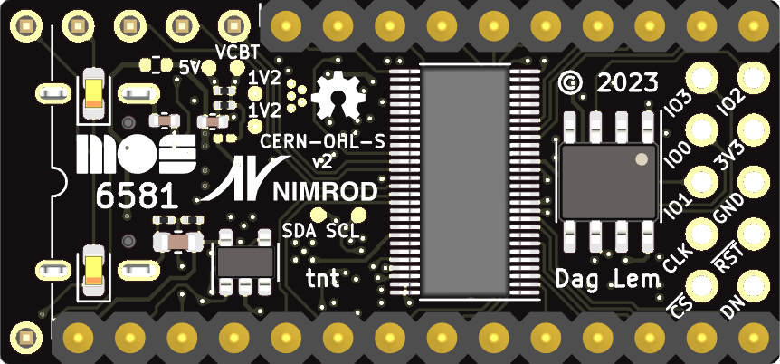

# reDIP SID

## MOS 6581/8580 SID FPGA emulation platform

## Overview
The reDIP SID is an open source hardware development board which combines the following in a DIP-28 size package:

* Lattice iCE40UP5K FPGA
* NXP SGTL5000 Audio Codec
* 128Mbit FLASH
* 64Mbit PSRAM
* User LED
* Push button
* USB-C receptacle for power and FPGA Full Speed USB
* 5V tolerant I/O

The reDIP SID provides a fully functional open source hardware platform for MOS 6581/8580 SID emulation.

The reDIP SID also aims to be a good no-frills generic choice for FPGA projects which may find use for audio and/or 5V tolerant I/O -
it should be ideal for for e.g. retro computer and synthesizer projects.

Designs for the iCE40UP5K FPGA can be processed by [yosys](https://github.com/YosysHQ/yosys/) and [nextpnr](https://github.com/YosysHQ/nextpnr/).

The board is supported by the DFU [Nitro Bootloader](https://github.com/no2fpga/no2bootloader/), facilitating simple updates over USB using e.g. [dfu-util](http://dfu-util.sourceforge.net/).

## General use

### I/O interfaces

#### Header pins:

* 12V / 9V input (for SID audio output DC bias / C64 model detection)
* 5V input
* 19 FPGA GPIO
* 3 FPGA current drive / open-drain I/O
* 5 audio pins (stereo line input, stereo line output, SID audio output)
* GND

All FPGA header I/O is 5V tolerant, and can drive 5V TTL. JP1 can be shorted to make the 5V input pin bidirectional, e.g. to power 5V TTL devices from USB VBUS.

Note that the line inputs are not AC coupled - AC coupling must be externally added for audio applications.
Without external AC coupling, the line inputs can conceivably be used as generic ADCs.

The 12V / 9V input is connected to the SGTL5000 mic input via a 1/6 ratio voltage divider.

#### SPI / programming header:

A separate header footprint is provided for (Q)SPI peripherals / flash programming, with pinout borrowed from the [iCEBreaker Bitsy](https://github.com/icebreaker-fpga/icebreaker).

The header provides a 3.3V output, which may be used to power external devices. The 3.3V rail is supplied by a 700mA LDO.

#### USB-C functions:

* 5V power
* FPGA Full Speed USB

## MOS 6581/8580 SID compatibility

The board is fully pin compatible with the venerable MOS 6581/8580 SID sound chip.

The board features three additional address pins which may be connected to the Commodore 64, in order to make a second SID chip appear e.g. at address D420, D500, or DE00.

There is also an additional EXT IN audio input pin for a second SID chip, and separate stereo line output pins which may be connected directly to audio equipment.
Either the SID GND pin or GND on the programming header may be used as audio ground.

Cycle accurate emulation of the SID chip has been implemented in [gateware](gateware/).

## Thanks

Big thanks go to [Sylvain "tnt" Munaut](https://github.com/smunaut/), who has not only implemented support for the reDIP SID in his [Nitro Bootloader](https://github.com/no2fpga/no2bootloader/),
but has also identified shortcomings, suggested feature improvements, and provided invaluable help to ensure that the board actually works.

Thanks must also go to [Aidan Dodds](https://github.com/bit-hack) and [Paul Sajna](https://github.com/sajattack)
for putting the first prototype through its paces working on Dodds' [icesid](https://github.com/bit-hack/icesid), with guidance from Munaut.

## Board Front

## Board Back

